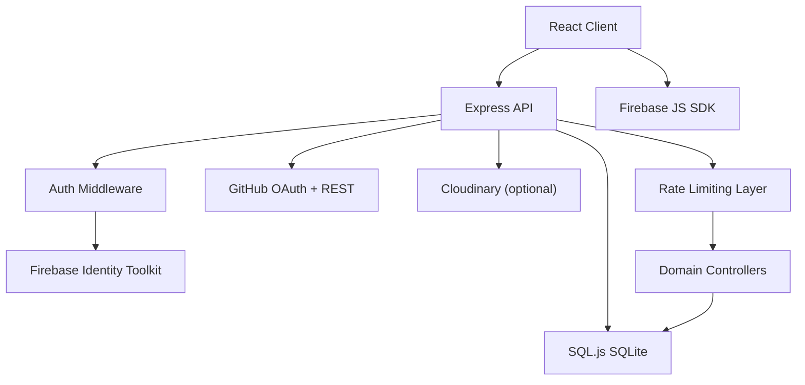
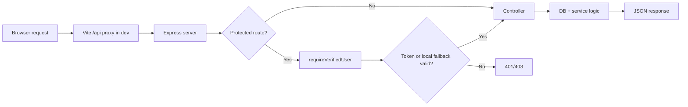
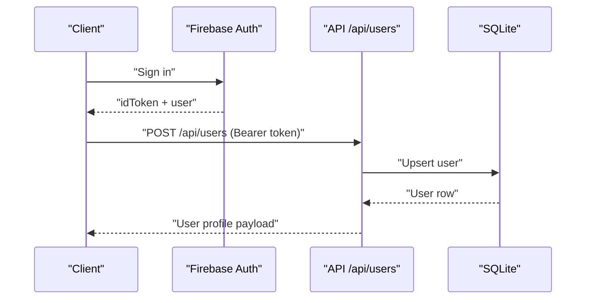
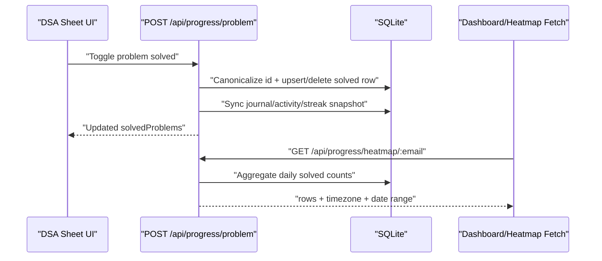

# AXIOM Technical Documentation

This document is the engineering reference for AXIOM internals: architecture, module contracts, API behavior, data model, runtime configuration, and operational procedures.

## 1. System Overview

AXIOM is a monorepo application composed of:

- `client`: Vite + React application
- `server`: Express API backed by SQL.js (SQLite)

Primary product surfaces:

- Daily command center dashboard
- DSA system with multi-sheet tracking and review scheduling
- OSS contribution intelligence with GitHub OAuth
- GSOC planning and reminders
- Education, interview prep, jobs/posts, and developer community chat
- Profile management and public portfolio route (`/u/:username`)

## 2. Architecture





## 3. Frontend Architecture

### 3.1 Routing

App router is defined in `/Users/kammatiaditya/AXIOM/client/src/App.jsx`.

Public routes:

- `/`
- `/docs`
- `/pricing`
- `/u/:username`
- `/login`
- `/signup`

Protected routes under `/app`:

- `/app` dashboard
- `/app/dsa` DSA home
- `/app/dsa/:sheetId` DSA sheet detail
- `/app/oss`
- `/app/gsoc`
- `/app/education`
- `/app/interview`
- `/app/connect`
- `/app/jobs`
- `/app/posts`
- `/app/profile`
- `/app/settings`

React Router v7 future flags are enabled on `BrowserRouter`:

- `v7_startTransition`
- `v7_relativeSplatPath`

### 3.2 State and Data Hooks

Primary client state modules:

- `useStore` (`client/src/store/useStore.js`): DSA solved state and mutation tracking
- `useDsaData` (`client/src/hooks/useDsaData.js`): catalog + progress aggregation + sheet stats
- `useUserStore` (`client/src/stores/useUserStore.js`): profile hydration with in-flight dedupe and cache semantics
- `AuthContext` (`client/src/contexts/AuthContext.jsx`): Firebase auth lifecycle + backend sync

### 3.3 API Client Behavior

`client/src/lib/api.js` includes:

- token acquisition with auth readiness wait
- typed auth errors (`AUTH_MISSING_TOKEN`, `AUTH_INVALID_TOKEN`, `AUTH_EMAIL_MISMATCH`)
- GET request de-duplication
- bounded retry for GET `429`
- global cooldown behavior for burst `429`
- backend unavailable cooldown behavior for proxy/downstream failure
- stale GET response caching for resilience

## 4. Backend Architecture

### 4.1 Middleware Stack

Server bootstrap in `/Users/kammatiaditya/AXIOM/server/index.js` applies:

- `helmet`
- read/write rate limiters (configurable)
- `compression`
- `morgan`
- `cors`
- `express.json`
- request sanitation (`sanitizeBody`)

### 4.2 Auth Model

Auth middleware: `/Users/kammatiaditya/AXIOM/server/middleware/auth.js`.

Key behaviors:

- verifies Firebase bearer tokens via Identity Toolkit API
- derives authoritative identity from token email (`req.authEmail`)
- rejects cross-email access with `403`
- supports explicit local dev fallback behavior via env toggles

Production contract:

- fail-closed token verification
- no unauthenticated bypass behavior

### 4.3 Rate Limiting

Limiter is split by request class:

- read limiter for `GET/HEAD/OPTIONS`
- write limiter for mutating methods

Key controls:

- `ENABLE_DEV_RATE_LIMIT`
- `ALLOW_LOCAL_RATE_LIMIT_BYPASS`
- `DISABLE_RATE_LIMIT`

`/health` includes limiter diagnostics in non-production mode.

## 5. Domain Modules

### 5.1 Dashboard

Purpose:

- consolidated daily command center for DSA and OSS momentum

Main endpoints:

- `GET /api/progress/dashboard/:email`
- `GET /api/progress/heatmap/:email?days=365&tz=<IANA>`
- `GET /api/progress/focus/:email?limit=<n>&tz=<IANA>`

Notable behaviors:

- heatmap uses DSA solved counts per day
- focus limit is enforced server-side by plan entitlement

### 5.2 DSA Engine

Routes:

- `GET /api/progress/catalog` (public)
- `GET /api/progress/:email`
- `POST /api/progress/problem`
- `GET /api/progress/problem-meta/:email`
- `POST /api/progress/problem-meta`
- `GET /api/progress/review/:email`
- `POST /api/progress/review/complete`
- `GET /api/progress/heatmap/:email`

Catalog characteristics:

- 3 sheets: Love 450, Striver SDE, Striver A2Z
- 99 topics, 1096 entries
- deterministic problem IDs
- legacy ID compatibility map

Data integrity behaviors:

- solve operation auto-seeds journal row (if missing)
- unsolve path canonicalizes aliases and cleans review/journal consistency
- streaks are recomputed from solved history by day keys
- study-time aggregation is delta-based from journal updates

### 5.3 OSS Contribution Engine

Routes:

- `GET /api/oss/github/connect-url`
- `GET /api/oss/github/callback`
- `GET /api/oss/github/profile/:email`
- `GET /api/oss/sync-status/:email`
- `POST /api/oss/sync/:email`
- `POST /api/oss/github/disconnect`
- `GET /api/oss/contributions/:email`
- `GET /api/oss/activity/:email`
- `GET /api/oss/issue/:email`

Behavior:

- OAuth callback triggers initial sync workflow
- contribution summaries and PR history are persisted for dashboarding
- issue recommendation logic combines skill and DSA signal sources

### 5.4 GSOC Accelerator

Routes:

- `GET /api/gsoc/timeline`
- `GET /api/gsoc/orgs`
- `GET /api/gsoc/readiness/:email`
- `GET /api/gsoc/reminders/:email?includeDismissed=true|false`
- `POST /api/gsoc/reminders/dismiss`
- `POST /api/gsoc/reminders/restore`

Behavior:

- readiness score combines DSA and OSS metrics
- reminders support active + dismissed state management

### 5.5 Dev Connect (Chat)

Routes:

- `GET /api/chat/channels`
- `POST /api/chat/channels`
- `GET /api/chat/messages/:channelId`
- `GET /api/chat/messages/:channelId/new`
- `POST /api/chat/messages`
- `DELETE /api/chat/messages/:id`
- `GET /api/chat/channels/:channelId/members`
- `POST /api/chat/channels/:channelId/invite`
- `POST /api/chat/channels/:channelId/members/remove`
- `GET /api/chat/online`

Private room model:

- owner + accepted members can read/write private channels
- non-members are denied

### 5.6 Remaining Modules

Education:

- `GET /api/education/catalog` (public)
- `GET /api/education/progress/:email`
- `POST /api/education/watched`
- `POST /api/education/progress`
- `GET /api/education/topics/:email`
- `GET /api/education/recent/:email`

Interview:

- `GET /api/interview/resources` (public)
- `GET /api/interview/progress/:email`
- `POST /api/interview/resources/:id/complete`

Jobs:

- listing endpoints are public
- user save/apply endpoints are protected

Posts:

- public feed and comments
- protected vote/save/comment/create actions

Settings:

- `GET /api/settings/:email`
- `POST /api/settings`
- `POST /api/settings/theme`
- `POST /api/settings/notifications`

Users:

- `GET /api/users/public/:username` (public)
- protected profile, ATS, username updates, create-or-get user

## 6. Data Model

Core schema file:

- `/Users/kammatiaditya/AXIOM/server/migrations/001_sqlite_schema.sql`

Runtime schema backfills:

- `/Users/kammatiaditya/AXIOM/server/config/db.js`

### 6.1 Key Tables by Domain

| Domain | Tables |
|---|---|
| Identity/Profile | `users`, `user_settings` |
| DSA | `solved_problems`, `dsa_problem_journal`, `user_progress`, `user_activity` |
| OSS | `github_connections`, `github_pull_requests`, `github_contribution_daily`, `good_first_issue_cache` |
| GSOC | `gsoc_reminder_state` |
| Education | `education_progress` |
| Interview | `interview_resources`, `user_interview_progress` |
| Community | `chat_channels`, `chat_room_members`, `chat_messages`, `posts`, `post_comments`, `post_interactions` |
| Jobs | `jobs`, `saved_jobs`, `applied_jobs` |

## 7. Configuration Reference

### 7.1 Server Runtime Modes

- `npm run dev:safe`
  - `NODE_ENV=development`
  - local rate-limit bypass enabled
  - dev rate-limit disabled
- `npm run dev:strict`
  - `NODE_ENV=development`
  - local bypass disabled
  - dev throttling enabled

### 7.2 Production Guardrails

- startup fails when Firebase API key is missing
- production auth is fail-closed
- rate limiting is active and split by method class

## 8. Sequence Flows

### 8.1 Login + Backend Sync



### 8.2 DSA Toggle + Heatmap Impact



## 9. Error Model and Recovery

Common API statuses:

- `200`: success
- `400`: validation/input errors
- `401`: missing or invalid token
- `403`: authenticated user/email mismatch
- `404`: route not found
- `429`: rate limited
- `500`: internal error

Client-side resilience patterns:

- no silent mutation retries for non-idempotent writes
- GET retry limited to one attempt for transient `429`
- global cooldown to avoid request storms
- stale data fallback when live fetch is temporarily blocked

## 10. Local Development

### 10.1 Start Commands

```bash
cd /Users/kammatiaditya/AXIOM
npm run dev:server
npm run dev:client
```

### 10.2 Smoke and Build

```bash
cd /Users/kammatiaditya/AXIOM/server && npm run smoke
cd /Users/kammatiaditya/AXIOM/client && npm run lint && npm run build
```

### 10.3 Health Checks

- API root: `http://localhost:3000/`
- API health: `http://localhost:3000/health`
- Client: `http://localhost:5173/`

## 11. Troubleshooting Guide

### 11.1 Repeated 401

- verify Firebase env values in client
- verify server Firebase key exists
- verify request email matches signed-in token email
- confirm local fallback settings if intentionally developing without token verification

### 11.2 Repeated 429

- run backend in `dev:safe`
- avoid strict mode unless intentionally load-testing limiter behavior
- inspect `/health` limiter diagnostics in non-production mode

### 11.3 500 during `/api/users` sync

- confirm backend process is running
- inspect server logs for controller stack trace
- run smoke test to isolate contract regression

### 11.4 “No data unless logout/login” behavior

- verify auth sync and profile store dedupe are active
- ensure backend is healthy before opening multiple protected pages in parallel
- verify no stale remote `VITE_API_URL` is forcing unreachable backend in dev

## 12. Release Checklist

- `npm run check` passes from repo root
- backend auth behavior validated (`401`, `403`, and success paths)
- DSA toggles persist and survive refresh
- dashboard and DSA heatmaps reflect solved changes
- OSS connect/sync/disconnect roundtrip validated
- GSOC reminder dismiss/restore validated
- no disconnected routes/assets remain
