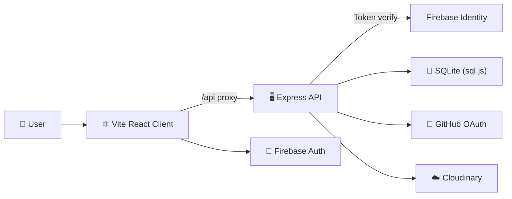

<div align="center">


# AXIOM

### The Developer Career Command Center

**Stop juggling 10 platforms. One place for DSA, OSS, GSOC, interviews, jobs, and your public portfolio.**

[](https://github.com/Adi-gitX/AXIOM/actions/workflows/ci.yml)
[](LICENSE)
[](https://github.com/Adi-gitX/AXIOM/stargazers)
[](https://github.com/Adi-gitX/AXIOM/network)
[](CONTRIBUTING.md)
[](https://github.com/Adi-gitX/AXIOM/issues)

[🚀 Live Demo](https://axiomdev.vercel.app) · [📖 Docs](APP_DOCUMENTATION.md) · [🐛 Report Bug](https://github.com/Adi-gitX/AXIOM/issues/new?template=bug_report.yml) · [✨ Request Feature](https://github.com/Adi-gitX/AXIOM/issues/new?template=feature_request.yml)

</div>

---

## 💡 The Problem

Every aspiring developer faces the same chaos:

> *"I use LeetCode for DSA, another site for interview prep, LinkedIn for jobs, GitHub for OSS, a spreadsheet for tracking, and I still have no idea if I'm making progress."*

**AXIOM eliminates the fragmentation.** It's a single, execution-first command center where you track DSA streaks, prepare for GSOC, build your OSS portfolio, prep for interviews, and find jobs — all with real-time progress visibility.

---

## ⚡ Feature Overview

| Module | What It Does | Why It Matters |
|--------|-------------|----------------|
| 📊 **Dashboard** | Unified command center with heatmaps, streaks & stats | See your entire developer journey at a glance |
| 🧮 **DSA Tracker** | 1,096 problems across 3 sheets with spaced repetition | Never lose track of what you've solved or need to review |
| 🌐 **OSS Engine** | GitHub OAuth sync, contribution tracking, issue finder | Build real OSS momentum with actionable insights |
| 🎓 **GSOC Accelerator** | Timeline, org explorer, readiness scoring | Know exactly where you stand for GSOC applications |
| 📚 **Education Hub** | 18+ curated topic tracks with progress tracking | Structured learning from top creators, not random YouTube |
| 🎤 **Interview Prep** | Coding, system design, behavioral & resume resources | Comprehensive prep in one place |
| 💼 **Jobs Board** | Developer-focused listings with save & apply | Find opportunities without the noise |
| 💬 **Dev Connect** | Real-time community chat with channels | Learn and grow with peers, not in isolation |
| 📝 **Posts Feed** | Aggregated dev content from HN, Dev.to, Reddit | Stay current without tab-hopping |
| 🪪 **Public Portfolio** | Shareable profile at `/u/username` with ATS scoring | Show employers your actual progress |

---

## 🚀 Quick Start

### Prerequisites

- **Node.js** 18+ and **npm** 9+
- A [Firebase](https://firebase.google.com/) project (for authentication)
- *(Optional)* GitHub OAuth app, Cloudinary credentials

### Install & Run

```bash
# Clone the repo
git clone https://github.com/Adi-gitX/AXIOM.git
cd AXIOM

# Install dependencies
npm --prefix client install
npm --prefix server install

# Start the backend (Terminal 1)
npm run dev:server

# Start the frontend (Terminal 2)
npm run dev:client
```

Open [http://localhost:5173](http://localhost:5173) and you're live! 🎉

> **Tip:** The Vite dev server auto-starts the backend if it detects it's down. Zero-config local development.

---

## 🏗️ Architecture



| Layer | Tech |
|-------|------|
| **Frontend** | React 18 + Vite + TailwindCSS + Framer Motion + Zustand |
| **Backend** | Express 5 + SQL.js + Firebase Admin |
| **Auth** | Firebase Authentication + Bearer tokens |
| **Media** | Cloudinary CDN (optional) |
| **CI/CD** | GitHub Actions → Vercel |

---

## 🧮 DSA System Highlights

- **3 integrated sheets**: Love Babbar 450 · Striver SDE · Striver A2Z
- **1,096 problems** across **99 topics** with deterministic IDs
- Per-problem metadata: notes, time spent, attempts, difficulty
- **Spaced repetition** with review queues and due dates
- **Activity heatmap** — DSA questions solved per day, timezone-aware
- **Streak tracking** — consecutive days of practice

---

## 📁 Project Structure

```
AXIOM/
├── client/                  # ⚛️ Vite + React + Tailwind + Zustand
│   ├── src/
│   │   ├── pages/           # Route-level page components
│   │   ├── components/      # Reusable UI components
│   │   ├── lib/             # API client, utilities
│   │   ├── contexts/        # React contexts (Auth)
│   │   └── stores/          # Zustand state stores
│   └── ...
├── server/                  # 🖥️ Express + SQL.js
│   ├── controllers/         # Domain logic (DSA, OSS, GSOC...)
│   ├── middleware/           # Auth, rate limiting
│   ├── migrations/          # Database schema
│   └── ...
├── CONTRIBUTING.md          # 👋 How to contribute
├── APP_DOCUMENTATION.md     # 📖 Deep technical reference
└── README.md                # ← You are here
```

---

## 🔐 Environment Variables

<details>
<summary><strong>Client (<code>client/.env</code>)</strong></summary>

| Variable | Required | Purpose |
|----------|----------|---------|
| `VITE_FIREBASE_API_KEY` | ✅ | Firebase client auth |
| `VITE_FIREBASE_AUTH_DOMAIN` | ✅ | Firebase auth domain |
| `VITE_FIREBASE_PROJECT_ID` | ✅ | Firebase project |
| `VITE_FIREBASE_STORAGE_BUCKET` | ✅ | Firebase storage |
| `VITE_FIREBASE_MESSAGING_SENDER_ID` | ✅ | Firebase messaging |
| `VITE_FIREBASE_APP_ID` | ✅ | Firebase app ID |
| `VITE_API_URL` | — | Override API base URL |
| `VITE_CLOUDINARY_CLOUD_NAME` | — | Image upload support |

</details>

<details>
<summary><strong>Server (<code>server/.env</code>)</strong></summary>

| Variable | Required | Purpose |
|----------|----------|---------|
| `PORT` | — | API port (default: 3000) |
| `NODE_ENV` | ✅ | `development` or `production` |
| `FIREBASE_API_KEY` | ✅ prod | Token verification |
| `GITHUB_CLIENT_ID` | — | GitHub OAuth |
| `GITHUB_CLIENT_SECRET` | — | GitHub OAuth |
| `CLOUDINARY_CLOUD_NAME` | — | Media uploads |
| `CLOUDINARY_API_KEY` | — | Media uploads |
| `CLOUDINARY_API_SECRET` | — | Media uploads |

</details>

---

## 🧪 Scripts

| Command | What it does |
|---------|-------------|
| `npm run dev:client` | Start Vite dev server |
| `npm run dev:server` | Start backend (safe mode) |
| `npm run lint` | Run ESLint on client |
| `npm run build` | Production build |
| `npm run smoke` | Server smoke tests |
| `npm run check` | Full quality gate: smoke + lint + build |

---

## 🤝 Contributing

We love contributions! AXIOM is built by students, for students.

1. 🍴 **Fork** the repo
2. 🔧 **Create** a feature branch (`add-streak-badges`)
3. ✅ **Run** `npm run check` to verify
4. 📬 **Open** a Pull Request

👉 **[Read the full Contributing Guide →](CONTRIBUTING.md)**

👉 **[Find Good First Issues →](https://github.com/Adi-gitX/AXIOM/issues?q=is%3Aissue+is%3Aopen+label%3A%22good+first+issue%22)**

---

## 🗺️ Roadmap

| Phase | Status | Features |
|-------|--------|----------|
| **MVP** | ✅ Done | Auth, Dashboard, DSA, Education, Jobs, Chat, Profiles |
| **Enhancement** | 🚧 In Progress | Notifications, AI recommendations, analytics, mobile optimization |
| **Expansion** | 📋 Planned | Study rooms, interview scheduler, resume builder, company reviews |
| **Scale** | 🔮 Future | Mobile app, AI code review, premium tier, public API |

---

## 🌟 Star History

If AXIOM helps you level up, consider starring the repo — it helps more developers discover it!

[](https://star-history.com/#Adi-gitX/AXIOM&Date)

---

## 📊 Ecosystem

AXIOM is part of a broader developer growth ecosystem:

| Project | Purpose |
|---------|---------|
| **[AXIOM](https://github.com/Adi-gitX/AXIOM)** | Developer career command center |
| **[PeopleMission](https://github.com/Adi-gitX/PeopleMission)** | Student missions & OSS contributions |
| **[Oracle](https://github.com/Adi-gitX/Oracle)** | Code validation & verification |
| **[why-this-broke](https://github.com/Adi-gitX/why-this-broke)** | Debug reproducibility tracking |

---

## 📜 License

MIT © [Aditya Kammati](https://github.com/Adi-gitX) — see [LICENSE](LICENSE) for details.

---

<div align="center">

**Built with ❤️ for the developer community**

[⭐ Star this repo](https://github.com/Adi-gitX/AXIOM) · [🍴 Fork it](https://github.com/Adi-gitX/AXIOM/fork) · [🐛 Report a bug](https://github.com/Adi-gitX/AXIOM/issues)

</div>
