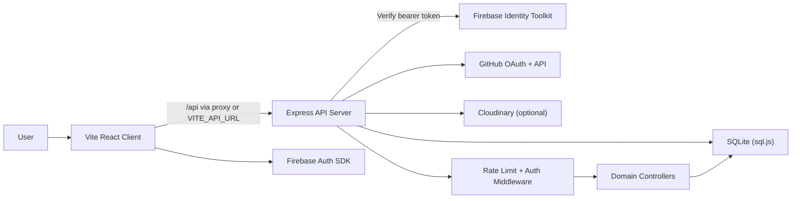
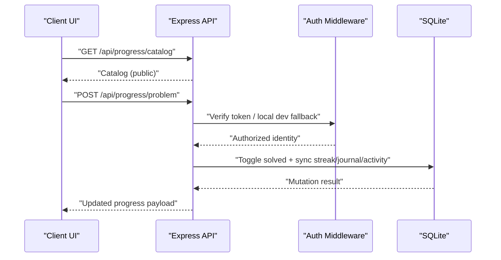

# AXIOM

AXIOM is a full-stack developer growth platform for students and early-career engineers.
It combines daily execution systems for DSA, OSS, GSOC preparation, interview prep, education tracking, community collaboration, and public portfolio presentation.

## Table of Contents

- [What AXIOM Solves](#what-axiom-solves)
- [Core Capabilities](#core-capabilities)
- [Architecture](#architecture)
- [Monorepo Layout](#monorepo-layout)
- [DSA System Highlights](#dsa-system-highlights)
- [Quick Start](#quick-start)
- [Environment Variables](#environment-variables)
- [Scripts](#scripts)
- [API Surface Overview](#api-surface-overview)
- [Security and Reliability](#security-and-reliability)
- [Operational Runbook](#operational-runbook)
- [Quality Gates](#quality-gates)
- [Contributing](#contributing)

## What AXIOM Solves

AXIOM is designed as an execution-first command center, not just a content browser.

It gives users:

- Daily progress visibility with DSA-focused activity heatmaps and streaks
- Structured DSA workflow with sheet-level tracking, review queues, notes, and time logs
- OSS momentum tracking through GitHub OAuth sync and issue recommendations
- GSOC readiness planning with timelines, organizations, and reminders
- Career-facing outputs through public portfolio and ATS scoring

## Core Capabilities

- Dashboard command center (`/app`)
- DSA Experience 2.0 (`/app/dsa`, `/app/dsa/:sheetId`)
- OSS Contribution Engine (`/app/oss`)
- GSOC Accelerator (`/app/gsoc`)
- Education Hub (`/app/education`)
- Interview Prep (`/app/interview`)
- Dev Connect (`/app/connect`)
- Jobs (`/app/jobs`) and Posts (`/app/posts`)
- Profile and public portfolio (`/app/profile`, `/u/:username`)

## Architecture





## Monorepo Layout

```text
AXIOM/
├── client/                  # Vite + React + Tailwind + Zustand
├── server/                  # Express + SQL.js + domain controllers
├── README.md
└── APP_DOCUMENTATION.md
```

## DSA System Highlights

- Integrated catalog from 3 sheets:
  - Love Babbar 450 (`love450`)
  - Striver SDE (`striverSDE`)
  - Striver A2Z (`striverA2Z`)
- Current imported scale: `99 topics`, `1096 problems`
- Canonical deterministic IDs: `<sheetId>:<topicPosition>:<questionIndex>`
- Legacy compatibility mapping is preserved (`a1`, `l1`, etc.)
- Per-problem journal metadata:
  - notes
  - time spent
  - attempts
  - spaced repetition interval + due date
- Heatmap semantics:
  - DSA questions solved per day
  - timezone-aware via `tz` query parameter

## Quick Start

### Prerequisites

- Node.js `18+`
- npm `9+`
- Firebase project for auth
- GitHub OAuth app for OSS connect flow (optional but recommended)
- Cloudinary credentials for signed uploads (optional)

### Install

```bash
# root
cd /Users/kammatiaditya/AXIOM

# install workspace dependencies
npm --prefix client install
npm --prefix server install
```

### Run (recommended local flow)

```bash
# terminal 1
npm run dev:server

# terminal 2
npm run dev:client
```

The client also includes an auto-start backend plugin for local development.
If `/health` is unavailable, Vite can spawn backend `dev:safe` automatically.

## Environment Variables

### Client (`client/.env`)

| Variable | Required | Purpose |
|---|---|---|
| `VITE_FIREBASE_API_KEY` | Yes | Firebase client auth |
| `VITE_FIREBASE_AUTH_DOMAIN` | Yes | Firebase auth domain |
| `VITE_FIREBASE_PROJECT_ID` | Yes | Firebase project |
| `VITE_FIREBASE_STORAGE_BUCKET` | Yes | Firebase storage |
| `VITE_FIREBASE_MESSAGING_SENDER_ID` | Yes | Firebase messaging sender |
| `VITE_FIREBASE_APP_ID` | Yes | Firebase app id |
| `VITE_FIREBASE_MEASUREMENT_ID` | No | Analytics id |
| `VITE_API_URL` | No | Override API base URL |
| `VITE_ALLOW_REMOTE_API_IN_DEV` | No | Allow remote API during Vite dev |
| `VITE_DEV_AUTH_FALLBACK` | No | Local auth fallback behavior |
| `VITE_ENABLE_GLOBAL_429_COOLDOWN` | No | Enables client global 429 cooldown in dev |
| `VITE_AUTOSTART_BACKEND` | No | Vite auto-spawns backend if down |
| `VITE_CLOUDINARY_CLOUD_NAME` | No | Cloudinary upload support |
| `VITE_CLOUDINARY_API_KEY` | No | Cloudinary signed upload support |
| `VITE_CLOUDINARY_UPLOAD_PRESET` | No | Cloudinary upload preset |

### Server (`server/.env`)

| Variable | Required | Purpose |
|---|---|---|
| `PORT` | No | API port (`3000` default) |
| `NODE_ENV` | Yes | `development` or `production` |
| `FIREBASE_API_KEY` | Yes in prod | Token verification key |
| `FIREBASE_WEB_API_KEY` | Fallback | Alternate Firebase key name |
| `ALLOW_UNAUTHENTICATED_DEV` | No | Dev auth bypass toggle |
| `ALLOW_DEV_AUTH_HEADER` | No | Allow local `x-axiom-dev-auth-email` |
| `ALLOW_LOCAL_AUTH_FALLBACK` | No | Local fallback when verification fails |
| `ENABLE_DEV_RATE_LIMIT` | No | Enables rate limit in dev |
| `ALLOW_LOCAL_RATE_LIMIT_BYPASS` | No | Skip limiter for local traffic |
| `DISABLE_RATE_LIMIT` | No | Fully disables limiter |
| `FRONTEND_URLS` | No | Extra CORS origins |
| `FRONTEND_URL` / `CLIENT_URL` | No | OSS redirect and link helpers |
| `BACKEND_URL` / `API_BASE_URL` | No | API base resolution |
| `GITHUB_CLIENT_ID` | No | GitHub OAuth |
| `GITHUB_CLIENT_SECRET` | No | GitHub OAuth |
| `GITHUB_REDIRECT_URI` | No | GitHub callback override |
| `GITHUB_STATE_SECRET` | Recommended | OAuth state security |
| `CLOUDINARY_CLOUD_NAME` | No | Cloudinary |
| `CLOUDINARY_API_KEY` | No | Cloudinary |
| `CLOUDINARY_API_SECRET` | No | Cloudinary |

## Scripts

### Root

| Command | Description |
|---|---|
| `npm run dev:client` | Start Vite client |
| `npm run dev:server` | Start backend in safe mode |
| `npm run dev:server:strict` | Start backend in strict dev limiter mode |
| `npm run smoke` | Run server smoke test |
| `npm run lint` | Run client ESLint |
| `npm run build` | Build client production bundle |
| `npm run check` | Smoke + lint + build |

### Server

| Command | Description |
|---|---|
| `npm run dev` | Standard development server |
| `npm run dev:safe` | Local reliability mode (recommended) |
| `npm run dev:strict` | Strict local rate-limit testing mode |
| `npm run smoke` | End-to-end smoke checks |
| `npm run build:dsa-catalog` | Regenerate DSA catalog from source datasets |
| `npm run migrate` | Run DB migrations |
| `npm run seed:all` | Seed jobs and posts |

## API Surface Overview

Public endpoints:

- `GET /api/progress/catalog`
- `GET /api/gsoc/timeline`
- `GET /api/gsoc/orgs`
- `GET /api/education/catalog`
- `GET /api/interview/resources`
- `GET /api/users/public/:username`

Protected endpoints require verified identity (or local dev fallback mode):

- Users: `/api/users`, `/api/users/:email`, `/api/users/profile`, `/api/users/username`, `/api/users/ats/:email`
- Progress: `/api/progress/:email`, `/api/progress/problem`, `/api/progress/heatmap/:email`, `/api/progress/focus/:email`, `/api/progress/problem-meta/:email`, `/api/progress/review/:email`
- OSS: `/api/oss/github/connect-url`, `/api/oss/sync-status/:email`, `/api/oss/contributions/:email`
- GSOC: `/api/gsoc/readiness/:email`, `/api/gsoc/reminders/:email`
- Education, Interview, Jobs, Posts, Chat, Settings protected mutations and user-scoped reads

## Security and Reliability

- Bearer token verification via Firebase Identity Toolkit on protected routes
- Email mismatch protection (`403`) for user-scoped resources
- Production fail-fast when Firebase API key is missing
- Split rate limiting for read and write traffic
- Localhost bypass controls for development reliability
- Client request hardening:
  - GET de-duplication
  - bounded retry on `429`
  - cooldown behavior for repeated limit bursts
  - transient error resilience with stale snapshot fallback

## Operational Runbook

### 401 Unauthorized

1. Confirm client Firebase env variables are loaded.
2. Confirm server has `FIREBASE_API_KEY` (or fallback key var) configured.
3. In local dev, verify `ALLOW_UNAUTHENTICATED_DEV` / fallback config is intentional.
4. Check token mismatch scenarios where request email and token email differ.

### 429 Too Many Requests

1. Use backend safe mode locally: `npm run dev:server`.
2. Verify `ALLOW_LOCAL_RATE_LIMIT_BYPASS=true` and `ENABLE_DEV_RATE_LIMIT=false` for local reliability.
3. Check `/health` for limiter diagnostics in non-production mode.
4. Avoid triggering repeated mount loops in custom test flows.

### 500 Internal Server Error

1. Ensure backend is running (`http://localhost:3000/health`).
2. Run server smoke checks for regression isolation.
3. Inspect backend logs for route-level exception details.

## Quality Gates

```bash
cd /Users/kammatiaditya/AXIOM
npm run check
```

Recommended release gate:

- `npm run smoke` passes
- `npm run lint` passes
- `npm run build` passes
- manual auth sanity checks pass (login, protected fetch, mutation)
- DSA toggle persistence and heatmap update verified

## Contributing

1. Keep feature changes scoped and testable.
2. Preserve route contracts unless explicitly versioned.
3. Add or update smoke checks for API behavior changes.
4. Keep UI changes isolated from reliability-only fixes.

For deeper internal architecture and data contracts, see:

- [APP_DOCUMENTATION.md](./APP_DOCUMENTATION.md)
